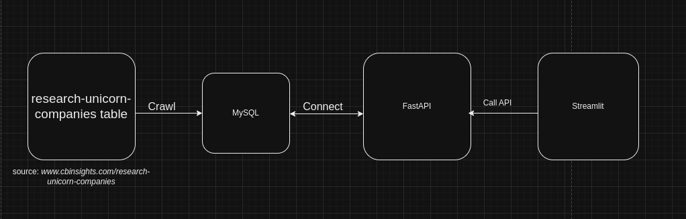

# Startup Valuations Dashboard

## Project Description
The Startup Valuations Dashboard is a web application for analyzing startup data, built using modern technologies including FastAPI, Streamlit, MySQL, and Docker.
## Table of contents
- [Features](#features)
- [Technoligies Used](#technologies-used)
- [System Requirements](#system-requirements)
- [Installation & Running the Project](#installation-&-running-the-project)
- [Projets Architechture](#projects-architechture)
- [API Endpoint](#api-endpont)
- [Custom & Extensions](#custom-&-extensions)
- [Notes](#features)
- [Contributing](#features)
## Features
- Detailed startup listing
- Country-wise startup analytics
- Industry-wise startup analytics
- Interactive visualizations and dashboards

## Technologies Used
- **Backend**: FastAPI
- **Frontend**: Streamlit
- **Database**: MySQL
- **Containerization**: Docker

## System Requirements
- Docker
- Docker Compose

## Installation & Running the Project

### Step 1: Clone Repository
```bash
git clone https://github.com/trann-namm/fastAPI_Streamlit_MySQL_app.git
cd fastAPI_Streamlit_MySQL_app
```

### Step 2: Run the Project
```bash
docker compose up --build
```
### Step 3: Verify the services
- Streamlit: Access the Streamlit UI at `http://localhost:8501/`.
- FastAPI: Access the FastAPI docs UI at `http://localhost:8000/docs`.
- 
**Diagram**:
 

---
## Project Architecture
```
fastAPI_Streamlit_MySQL_app
├── backend
│   ├── Dockerfile
│   ├── main.py
│   └── requirements.txt
├── Crawl
│   ├── crawling.py
│   ├── Dockerfile
│   └── requirements.txt
├── database
│   └── init.sql
├── docker-compose.yml
├── frontend
│   ├── app.py
│   ├── Dockerfile
│   └── requirements.txt
└── README.md

```

## API Endpoints
- `GET /startups`: Retrieve all startups
- `GET /startups/by_country`: Get startup statistics by country
- `GET /startups/by_industry`: Get startup statistics by industry

## Customization & Extension
- Crawl data into MySQL by using python `Crawl/crawling.py`
- Extend API endpoints in `backend/main.py`
- Customize dashboard interface in `frontend/app.py`

## Notes
- Ensure Docker and Docker Compose are installed
- Check network connections if encountering errors
- Review Docker logs for debugging

## Contributing
1. Fork the repository
2. Create your feature branch 
``` bash
git checkout -b feature/AmazingFeature
```
3. Commit your changes 
``` bash
git commit -m "Add some AmazingFeature"
```
4. Push to the branch
``` bash
git push origin feature/AmazingFeature
```
5. Open a Pull Request

## License
Distributed under the MIT License. See LICENSE for more information.

---

## **Contact**
If you have any questions, feel free to reach out:
- Email: namsherlock44@outlook.com
- GitHub: [@trann-namm](https://github.com/trann-namm)

---
